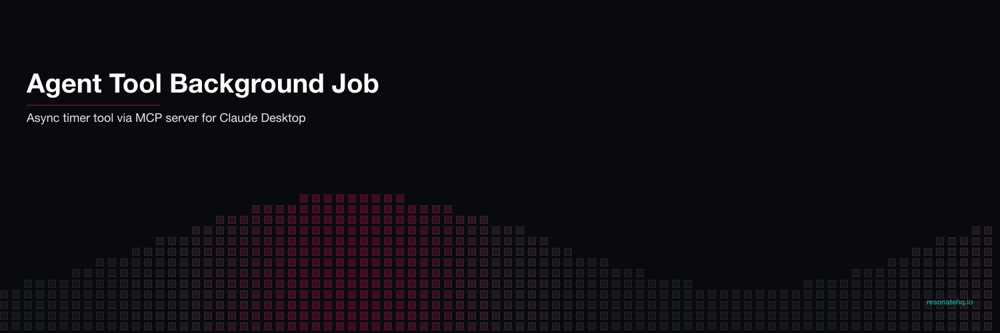

<p align="center">
  
</p>

# Async timer AI Agent tool | Resonate example application

This example shows a minimal example of Resonate + MCP.

To use Resonate in an MCP Server, the MCP Server needs to be run using "streamable-http" as the transport.

Therefore, you need a stdio -> streamable-http proxy running for Claude to talk to.

### proxy

```python
from fastmcp import FastMCP

# Create a proxy to a remote server
proxy = FastMCP.as_proxy(
    "http://localhost:5001/mcp",  # URL of the remote server
    name="Remote Server Proxy"
)


if __name__ == "__main__":
    proxy.run()  # Runs via STDIO for Claude Desktop
```

To run the proxy:

```shell
uv run proxy.py
```

### claude_desktop_config.json

Make sure Claude's config points at the proxy.

```json
{
  "mcpServers": {
    "timer": {
      "command": "uv", // or /opt/homebrew/bin/uv
      "args": [
        "--directory",
        "/FULL/PATH/TO/YOUR/TOOL/DIRECTORY/example-agent-tool-async-timer",
        "run",
        "proxy.py"
      ]
    }
  }
}
```

You should restart Claude desktop after changing this config.

On the MCP Server, make sure you return a promise ID - instead of blocking on a result.
Claude can then use the promise ID to check for the result at any point later on.

### timer mcp server

The function that runs in the back is decorated with `@resonate.register`.

**timer function**

```python
@resonate.register
def timer(ctx, timer_name, seconds):
    yield ctx.sleep(int(seconds))
    return "complete"
```

The functions that Claude interacts with are decorated with `@mcp.tool`

**set timer tool**

```python
@mcp.tool()
def set_timer(timer_name, seconds):
    # tool description

    _ = timer.run(timer_name, timer_name, seconds)
    return {"promise_id": timer_name}
```

**get timer status tool**

```python
@mcp.tool()
def get_timer_status(timer_name):
    # tool description

    promise_id = f"{timer_name}"
    handle = resonate.get(promise_id)
    if not handle.done():
        return {"status": "running"}
    return {"status": handle.result()}
```

To run the MCP server:

```shell
uv run timer.py
```
